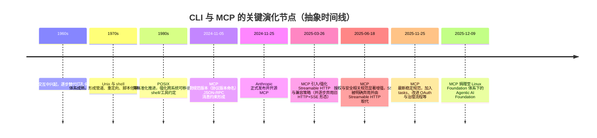
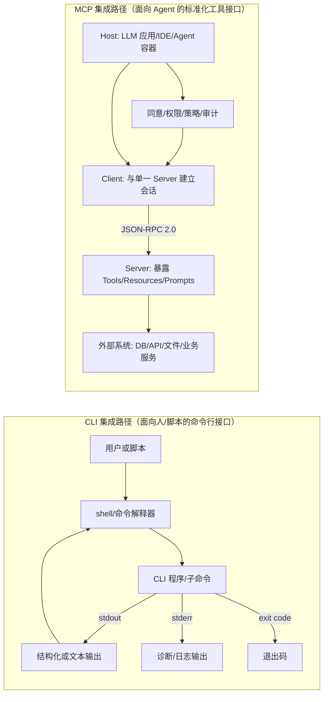
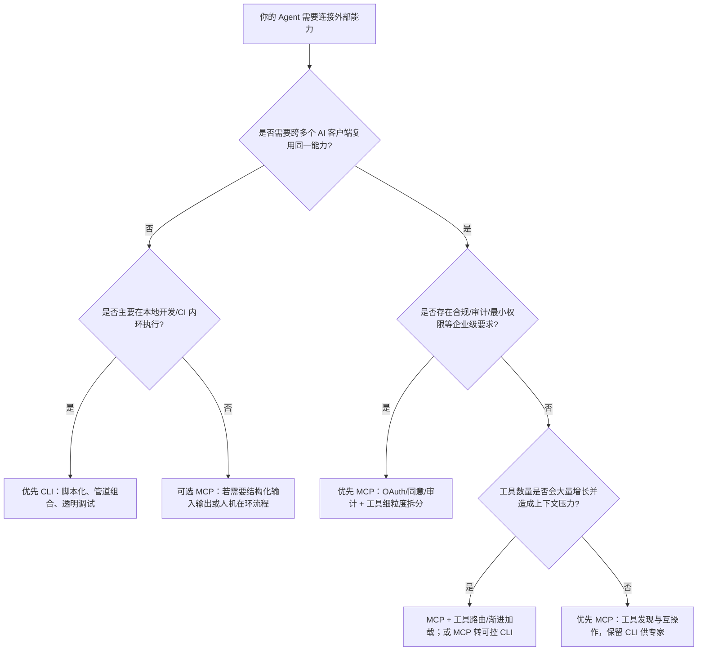

# MCP 与 CLI 之争：面向 AI Agent 工具集成的深度研究

## 执行摘要

围绕 “MCP vs CLI” 的讨论，本质上并非传统意义上“新协议取代命令行”，而是 AI Agent 时代的工具集成范式选择：到底应该把能力暴露为面向模型的、可发现且结构化的“工具接口”（MCP），还是把能力保留为面向人的、可组合且透明的“命令行工具”（CLI），再由 Agent 通过 shell/命令调度来完成工作。官方定义上，MCP 是开放协议与规范，目标是让 LLM 应用以标准方式连接外部系统；CLI 则是通过文本命令与程序交互的界面与约定体系，两者在抽象层级上并不对等，因此争论往往落在“工程落地路径”而非概念对比。citeturn5view0turn3search0turn12search0

综合官方规范、技术细节与社区争论，可以得到一个较一致的结论：CLI 往往更贴近“开发内环”（inner loop），强调速度、可控性、可复用的脚本化和管道组合；MCP 更贴近“集成外环”（outer loop），强调跨客户端互操作、工具发现、结构化输入输出、会话与权限边界、以及在企业环境中的治理与合规。多数成熟团队最终会走向“二者并存”，常见模式是以 CLI 作为底层实现与专家入口，同时以 MCP 作为面向 Agent 的标准化接口层与分发机制。citeturn12search0turn12search1turn6view0turn14view0

这场争论之所以在 2025 到 2026 年升温，直接原因之一是 MCP 规范快速演进并引入更“生产化”的能力（例如更完善的授权流程、对异步/长时操作的 tasks 支持、治理流程的形式化），同时社区也观察到“给 Agent 一个 Bash/CLI”在许多日常开发任务上更直接；另一原因是安全风险与成本结构发生变化：一方面，开放式 shell 或“万能工具”会放大命令注入与过度代理风险；另一方面，过多 MCP 工具定义与 schema 也可能造成上下文膨胀与推理质量下降，催生了“精简工具暴露”与“渐进式披露”等实践。citeturn5view1turn16search33turn12search4turn18search12turn13search10

## 术语与范围

本报告中的 “MCP”，指由 entity["company","Anthropic","ai company"] 在 2024-11-25 对外发布并开源的 Model Context Protocol，其官方定位是连接 LLM 应用与外部数据源、工具和工作流的开放协议，采用 JSON-RPC 2.0 消息格式，并以 Host-Client-Server 架构组织能力（Resources、Tools、Prompts 等）。citeturn0search1turn5view0turn6view0turn17search1

“CLI”在计算机领域通常指命令行界面：通过一行行文本命令与程序交互，通常由 shell 作为命令解释器承接输入输出，并通过 stdout/stderr、退出码等机制实现可组合、可脚本化的自动化。标准化层面，许多 CLI 约定与行为可在 POSIX Shell & Utilities 等规范与现代 CLI 设计指南中找到对应描述。citeturn3search4turn3search16turn0search35turn3search0

“CLI vs MCP”之所以存在歧义，是因为社区在讨论时常把 “CLI”缩写为一种“给 Agent 一个受控 shell（或少量 CLI 工具）”的集成策略，而把 “MCP”视为“为 Agent 提供大量可发现工具”的策略。这会把 CLI 从“人机交互界面”扩展为“Agent 工具调用接口”，并把 MCP 从“协议与规范”扩展为“一整套工具生态与分发方式”。因此，本文将比较对象明确为两类工程落地路径：其一是以 CLI（含 shell 调用与脚本）作为主要集成表面；其二是以 MCP Server 暴露结构化工具/资源作为主要集成表面。citeturn12search0turn6view0turn1search30turn13search4

未被用户明确指定但会显著影响结论的关键约束，本报告默认如下：部署环境可能同时包含本地开发机与远程服务；编程语言与框架不固定；规模从个人到企业均可能；存在一定比例遗留系统与既有 CLI/脚本资产；对安全合规的要求随组织规模上升而显著增强。若这些假设与实际不符，后文的决策矩阵应按“安全与治理优先级”和“跨客户端复用需求”重新加权。citeturn12search0turn16search33turn15view0

## 历史脉络与演化

CLI 的历史可追溯到 20 世纪中期：命令行在 1960 年代的终端交互中兴起，并在此后相当长时间内成为软件交互的主流形态；其长期生命力来自脚本化、可组合性与低门槛自动化（把一组命令保存为脚本重复执行）。即便 GUI 普及，CLI 在系统管理与开发工具链中仍高度常见。citeturn3search0turn0search35

与之对照，MCP 的出现属于 LLM 与 Agent 工具化的“新一代接口层”尝试。它在 2024-11-25 由 Anthropic 对外发布，并在 2025 年经历多次规范迭代，逐步补齐远程传输、授权与生产级运维能力；到 2025-12-09，MCP 被捐赠至 entity["organization","Linux Foundation","nonprofit, US"] 旗下的 entity["organization","Agentic AI Foundation","lf directed fund"] 以强化其中立治理与长期可持续性。citeturn0search1turn5view1turn14view0turn14view1

MCP 的“快速演化”也塑造了争论的一个关键主题：部分批评者（尤其在中文社区）质疑早期 HTTP+SSE 传输与会话设计带来的复杂性与“强制 stateful”的代价，并担心客户端兼容性与生态碎片化；而 MCP 官方规范则在后续版本中引入 Streamable HTTP、协议版本头、改进的会话处理与授权规范，并明确兼容旧传输的路径，试图降低早期设计的操作与演进成本。citeturn13search10turn5view2turn19search10turn19search5turn4search3

上述 MCP 版本节点与“弃用旧 SSE 传输、转向 Streamable HTTP、强化授权与治理”的脉络，均可在官方规范与相关权威解读中交叉验证。citeturn19search0turn19search1turn4search2turn4search3turn19search5turn14view0

## 核心技术架构

从官方规范看，MCP 的架构核心是 Host-Client-Server：Host 作为容器与协调者可管理多个 Client；每个 Client 与一个 Server 维持隔离的一对一会话；Server 以 MCP primitives 暴露 Prompts、Resources、Tools，并可通过客户端能力（如 sampling、elicitation、roots、tasks）触发更复杂的交互。Host 被明确赋予权限决策与安全边界控制职责，这是 MCP 试图为“Agent 访问外部系统”建立的系统性治理点。citeturn6view0turn5view0turn10view0

在通信层，MCP 明确采用 JSON-RPC 2.0 作为消息格式，并定义生命周期（初始化协商协议版本与能力、运行期通信、优雅关闭）。传输层在最新版本中以 stdio 与 Streamable HTTP 为标准路径，并对 HTTP 场景进一步规定协议版本头与会话标识等机制；授权层则提供可选但规范化的 OAuth 2.1 相关流程，强调 HTTP 场景应遵循该规范，而 stdio 传输不应套用同一授权流程而应从环境获取凭据。citeturn5view0turn10view0turn5view2turn8view0turn0search0

CLI 的典型架构则围绕 shell 与进程模型展开：用户或脚本通过命令行调用程序，程序以 stdout 输出结果、stderr 输出诊断信息，并以退出码向调用方表达成功或失败；shell 与系统工具约定（例如把输出作为数据流进行管道连接）支撑了 CLI 生态长期以来的组合性与脚本化自动化。现代 CLI 设计指南也明确强调这些机制（stdin/stdout/stderr、退出码、信号等）是“能让不同程序严丝合缝组合”的关键。citeturn3search16turn3search24turn3search9turn0search35turn3search4

该对照图对应的关键点（MCP 的 Host-Client-Server 分工、JSON-RPC 通信、以及 Host 负责权限与安全边界）可在 MCP 官方架构与规范概述中直接找到依据；CLI 的 stdout/stderr/退出码约定则可在 POSIX 与 Bash 等规则说明中找到依据。citeturn6view0turn5view0turn3search24turn3search9

## 维度对比与决策框架

### 属性速览对照表

| 属性 | MCP（作为 Agent 工具集成表面） | CLI（作为 Agent 工具集成表面） |
|---|---|---|
| 定义定位 | 开放协议与规范，标准化 LLM 应用连接外部系统（工具、资源、提示等），并强调会话与能力协商 | 文本命令交互界面与约定体系，强调脚本化与可组合的进程调用 |
| 主要“第一用户” | Host/Client 侧的 AI 应用与 Agent（并通过 Host 体现用户控制） | 人类开发者与自动化脚本（Agent 通过模拟“会用命令行”间接使用） |
| 可发现性 | 内建 tools/list、resources/list、prompts/list 等“可发现”机制与 schema 元数据 | 通常依赖 `--help`/man 文档与经验约定；可加 `--json` 等提升机器可读性但非统一标准 |
| 输入输出结构 | 工具输入 schema 明确，错误与进度等可协议化返回 | 输入多为字符串参数；输出常为文本，需解析；退出码与 stderr 语义约定依赖实现质量 |
| 传输与部署 | 标准支持 stdio 与 Streamable HTTP；可本地子进程或远程服务 | 通常本地进程调用，也可通过 SSH/远程执行间接扩展；无统一协议层 |
| 安全与授权 | Host 强调用户同意与控制；HTTP 传输可选 OAuth 2.1 授权规范 | OS 权限与执行环境决定边界；给 Agent shell 等于给广泛执行面，需强隔离与最小权限 |
| 治理与标准化 | 规范迭代、Key Changes、SEP 流程与治理文档形式化，并纳入 Linux Foundation 体系 | POSIX 等标准覆盖部分行为，但 CLI 生态整体更“约定俗成”，一致性取决于工具作者 |
| 生态趋势 | 供应商与平台（如 Microsoft 生态）推动 MCP 接入与认证/治理机制 | CLI 仍是开发工具链核心，社区强调其透明、可调试、组合性优势 |

表中 MCP 的协议特征、能力发现与治理流程依据 MCP 官方规范与治理文档；CLI 的机制依据 POSIX/Bash 与现代 CLI 设计指南；关于平台推动与认证的描述可见 Microsoft 相关文档。citeturn5view0turn6view0turn0search35turn3search24turn15view0turn17search4turn12search0

### 分维度优劣分析（含争论焦点）

**清晰定义与边界（含歧义）**  
MCP 的优势在于把“能力暴露”与“能力调用”定义为协议对象（Tools、Resources、Prompts），并明确 Host 负责权限与同意，这让“Agent 能做什么”在接口层更清晰；代价是 MCP 作为 stateful 协议需要生命周期管理与能力协商，工程上更像“集成平台”而非单个工具。citeturn5view0turn6view0turn10view0  
CLI 的优势在于接口极简且普适，只要能启动进程并读写 stdout/stderr 就能集成；但“接口语义”高度依赖具体工具的 `--help`、输出格式与退出码约定，且在 Agent 场景下往往会被简化为“给模型一个 shell”，导致边界从“执行某个工具”膨胀为“执行几乎任何命令”。citeturn0search35turn3search4turn16search33

**历史演化与生态动因**  
MCP 明确借鉴 Language Server Protocol 的生态路径（用统一协议让多客户端复用同一类能力），并在 2025 年通过规范迭代补齐远程与授权等生产需求；这解释了为什么支持者强调其“跨客户端互操作”“降低 N×M 集成成本”。citeturn5view0turn14view0turn4search3  
CLI 的生态动因更长期且稳定：管道、重定向、退出码等机制使工具天然可组合，且对开发者调试透明；在 Agent 时代，支持 CLI 的声音往往强调“让模型使用已有工具链”比“重新建协议工具生态”更快。citeturn0search35turn12search0turn1search30turn13search4

**核心架构与典型用例**  
MCP 的典型用例集中在需要“可发现能力、结构化输入、跨多个 LLM 客户端复用”的外部系统连接，例如把业务系统、知识库、数据库、工作流以标准方式暴露给不同 AI 应用；一些厂商也强调 MCP 连接后 actions/knowledge 可随功能演进自动更新，降低维护成本。citeturn5view0turn17search8turn17search9turn14view0  
CLI 的典型用例集中在本地开发、构建测试、脚本化运维、CI/CD 等场景，并通过 stdout/stderr/退出码实现可组合自动化；在 Agent 场景中，CLI 常用于“快速执行已有命令完成任务”，尤其适合一次性、探索式、强交互的工作（改代码、跑测试、看日志）。citeturn0search35turn3search9turn12search0turn12search1

**性能与成本（运行时、上下文与 token）**  
MCP 的主要性能优势来自结构化接口：工具 schema 与错误类型有助于模型自我纠错与减少“猜输出”的回合数，规范甚至专门讨论把输入校验错误作为工具执行错误返回，以便模型能在上下文中看到并修正参数；同时最新规范引入 tasks 支持长时操作并通过轮询/延迟取结果降低“挂起调用”的风险。citeturn16search6turn16search3turn10view0turn5view1  
MCP 的成本与争议点在于“上下文膨胀”：当客户端一次性加载大量工具定义与 rich schema，会显著占用上下文窗口并可能造成注意力稀释，社区因此提出“渐进式披露、精简工具暴露或把 MCP 转成可控 CLI”等做法，并报告在某些对照实验中 token 开销可大幅下降。citeturn12search4turn12search20turn18search12  
CLI 的运行时成本通常较可预测（本地进程直接执行），且对开发者而言“零协议开销”；但对模型而言，文本输出的歧义可能导致更高的交互回合与更多 token 消耗，社区也明确指出“少量 CLI 工具反而更容易失败”这一现象在实际使用中存在。citeturn12search0turn1search25turn0search35

**安全性（命令执行面、注入、工具投毒与信任模型）**  
从传统安全视角看，CLI 最大风险之一是命令注入：当不可信输入被拼接进 shell 命令时，攻击者可借此在宿主机执行任意命令；在 Agent 场景中，这会放大为“对话触发的远程代码执行风险”。citeturn0search3turn0search7turn16search29turn16search17  
从 GenAI 安全治理视角看，OWASP 的 LLM 风险分类明确建议避免“开放式函数/能力”（例如直接运行 shell 命令），应尽量用更细粒度、边界明确的工具替代，以降低过度代理导致的不可控行为面。citeturn16search33  
MCP 在协议层的安全设计优势在于：规范明确要求用户同意与控制、强调数据隐私边界，并警告工具描述/注释等元数据不应被默认信任；且在 HTTP 传输中可以采用标准化 OAuth 2.1 授权流程与一系列安全要求（PKCE、资源指标、受保护资源元数据发现等）。citeturn7view0turn8view0turn5view2  
MCP 的新增风险面在于“工具元数据攻击”：研究与业界分析指出，攻击者可通过操纵工具名称、描述与 schema 诱导模型偏选恶意工具，或在工具描述中隐藏对抗性指令，形成工具投毒、影子污染与“rug pull（批准后更改描述）”等攻击。对此已有研究提出签名清单、语义审查与运行期护栏等框架，但也意味着 MCP 在企业落地时需要额外的供应链与策略执行层。citeturn4academia31turn16academia39turn16search14turn7view0

**可扩展性（远程服务、并发、长时任务、运维）**  
MCP 的扩展性优势来自对远程传输与会话管理的显式规范：Streamable HTTP 在同一端点下结合请求响应与可选 SSE 流式机制，并规定协议版本头、会话标识与兼容旧传输的策略；最新版本还引入 tasks 支持耐久请求与延迟取结果，并在 roadmap 中继续讨论横向扩展与无状态操作等问题。citeturn5view2turn5view1turn4search16turn4search3  
MCP 的扩展性代价在于它更接近“服务化接口”，需要处理会话、认证、监控与多租户负载。来自 entity["company","Sentry","error monitoring company"] 的实践案例明确提到：本地 stdio 方案对高级用户可用但存在配置与更新的“尖锐边缘”，而在大规模用户负载下需要托管/远程方案并依赖 OAuth 等成熟认证方式。citeturn12search28  
CLI 的扩展性优势在于部署简单且天然适配本地与 CI 环境；但当你需要把它作为“远程多用户能力”提供给大量 Agent 时，就会走向自建调度层、隔离层与权限层（本质上在 CLI 外再造一个服务面），这也是很多团队最终引入 MCP 或类 MCP 网关的原因。citeturn12search0turn16search33turn12search1

**可维护性与可演进性（接口稳定、兼容、变更成本）**  
MCP 的可维护性优势来自协议化的能力发现、schema 约束与版本协商：生命周期要求初始化阶段协商协议版本与 capabilities，且规范对向后兼容有明确指导；此外，治理文档要求通过 SEP 提案机制演进规范，并在 Linux Foundation 体系内保持公开、可追溯的演进路径。citeturn10view0turn5view2turn15view0turn14view0  
MCP 的可维护性风险在于生态与实现层面的不一致：不同客户端对特性的支持程度、旧传输的遗留兼容诉求、以及工具数量爆炸带来的配置管理负担，均在社区讨论与厂商工具中反复出现；这也是为什么出现了“为 MCP server 配置做包管理/健康检查”“把 MCP 变成可控 CLI”的周边工具与实践。citeturn1search10turn12search4turn13search10  
CLI 的可维护性优势是“接口面小、失败模式清晰”（退出码、stderr、可追溯的命令与脚本），并且长期约定较稳定；但在 Agent 场景中，CLI 接口经常缺少机器可读 schema，输出格式变化会破坏解析与自动化，迫使团队走向“强约束输出（JSON）”“固定子命令契约”等额外工程规范。citeturn0search35turn3search24turn3search9

**开发者体验（人类开发者与 Agent 的可用性差异）**  
CLI 对专家开发者通常具有高透明度与强控制感，调试路径短，且可自然融入现有终端与脚本生态；这也是“CLI 内环效率”观点能获得广泛共鸣的原因。citeturn12search0turn12search1turn0search35  
MCP 对 Agent 的体验优势在于“可发现、可约束、可治理”：工具输入输出更结构化，Host 能集中处理同意、权限与审计；同时 MCP 也引入了对 elicitation（向用户请求补充信息）等交互能力的标准化描述，这对“人机在环”的 Agent 工作流尤其关键。citeturn6view0turn10view0turn4search18turn5view1  
争论焦点在于：如果 MCP 客户端把大量工具定义一次性塞进上下文，Agent 体验反而可能下降；因此实践上经常需要“工具路由、渐进加载、上下文工程”等配套手段来维持稳定体验。citeturn12search20turn18search12turn13search18

**工具与生态、互操作与迁移成本**  
MCP 的生态优势在于“协议即插即用”的目标逐步被落实：官方文档与规范提供实现指南，项目有 reference servers/registry 与治理流程；同时项目方披露了较快的增长与多平台采用，并把 MCP 纳入更中立的基金会治理结构以降低锁定风险。citeturn12search13turn14view0turn11view0turn15view0  
此外，部分平台开始引入“认证/准入”机制来控制 MCP server 的安全与合规风险，例如 Microsoft 明确要求 MCP server 通过其连接器认证流程才能面向更广泛用户提供服务，这显示 MCP 在企业生态中正向“标准化 + 治理”方向演进。citeturn17search4turn17search8  
CLI 的生态优势则是“存量巨大且跨语言通用”：几乎任何语言都能通过启动进程、读写管道来集成 CLI，且 CLI 本身是开发工具链的主通道；迁移成本上，最常见路径不是二选一，而是“双接口”：既保留 CLI 供人类与 CI 使用，又额外暴露 MCP server 供 AI 客户端使用，英文社区已有“CLI 同时暴露 MCP server”的实践讨论。citeturn1search4turn12search0turn0search35  
当组织已有大量 CLI/脚本资产时，把 CLI 包装成 MCP 工具往往是最低成本的渐进迁移路线，但必须补上权限、隔离、审计与输出结构化等工程要求，否则安全与可靠性会在 Agent 场景被放大。citeturn16search33turn0search3turn7view0turn12search28

### 场景决策矩阵（推荐选型）

| 场景 | 关键约束 | 推荐 | 说明 |
|---|---|---|---|
| 个人开发者/小团队，本地开发与一次性任务为主 | 追求最快迭代、强透明调试、低集成成本 | CLI 优先，必要时少量 MCP | CLI 适合内环；如使用多 AI 客户端且希望复用少量能力，可提供精简 MCP server 作为补充。citeturn12search0turn12search1turn0search35 |
| 中型团队，多工具链协作且希望跨 IDE/AI 客户端复用 | 工具发现、统一接口、减轻 N×M 适配 | MCP 优先，CLI 作为专家入口 | MCP 通过标准化 tools/resources/prompts 让多客户端复用；保留 CLI 供高级用户与 CI 使用。citeturn5view0turn6view0turn14view0 |
| 企业级系统接入（CRM/支付/工单/财务等），强合规与审计 | 最小权限、可追溯、可认证、可撤销授权 | MCP 且必须配套治理 | HTTP 场景可用 OAuth 规范与平台认证；Host 侧需同意流与审计；避免直接给 Agent 开放 shell。citeturn8view0turn17search4turn16search33turn7view0 |
| 高风险执行面（生产运维、涉密数据、可造成资金/配置变更） | 风险控制极高优先级 | MCP（细粒度工具）或 CLI（强沙箱 + 白名单），不建议开放式 shell | OWASP 明确反对开放式“run shell”能力；应拆分为受限工具并加策略执行层。citeturn16search33turn0search3turn4academia31 |
| 长时任务（数据处理、扫描、批量操作），需要可靠超时与恢复 | 避免挂起、支持进度与取消 | MCP（tasks + 进度/取消） | 最新规范加入 tasks 与相关能力声明，适配长时操作与延迟取结果。citeturn5view1turn10view0turn4search19 |
| 工具数量爆炸（几十到上百工具），上下文窗口敏感 | 控制 token、避免注意力稀释 | MCP 但必须做工具路由/渐进加载；或 MCP 转可控 CLI | 社区与实践指出一次性加载大量 schema 会压上下文，需要渐进式披露与精简策略。citeturn12search4turn12search20turn18search12 |
| 遗留系统多、现有脚本资产重 | 迁移成本与风险控制并重 | 先 CLI 稳定化输出与权限，再逐步包装 MCP | 先把 CLI 契约固化（结构化输出/稳定退出码/白名单），再作为 MCP tool 暴露以降低改造成本。citeturn0search35turn3search24turn12search28 |

上述推荐是对“内环效率 vs 外环治理”“开放式执行面 vs 细粒度能力”两条主线约束的综合权衡，并与主流社区观点与规范演进方向一致。citeturn12search0turn16search33turn14view0turn5view1

该选择流强调：只要存在“开放式 shell”倾向，就必须把安全与治理作为一等约束，否则风险会压倒效率收益。citeturn16search33turn0search3turn7view0turn8view0

## 结论与实践建议

综合官方定义、规范细节与社区争论，最稳健的结论是：MCP 与 CLI 不是互斥替代关系，而是分别对应“协议化互操作的能力层”和“人类与脚本友好的执行层”。当你的目标是让多个 AI 客户端以一致方式接入外部系统，并且需要结构化能力发现、权限边界与可治理性时，MCP 提供了更直接的标准化路径；当你的目标是最小化集成成本、最大化透明调试与组合自动化效率时，CLI 仍是最短路径。把争论简化为“新协议是否取代命令行”会误判工程成本与安全责任边界。citeturn12search0turn5view0turn6view0turn0search35turn16search33

对不同组织规模的落地建议如下。对小团队与个人开发者，建议以 CLI 为主，优先把 CLI 契约做“机器友好化”（稳定的退出码语义、stderr 仅诊断信息、必要时提供 JSON 输出），并在需要接入特定 AI 客户端时用少量 MCP server 做桥接，同时严格限制工具数量以避免上下文膨胀。citeturn3search24turn3search9turn0search35turn12search4

对中型组织，建议采用“双入口”策略：关键业务能力与跨团队共享能力以 MCP 暴露，同时保留等价 CLI 供专家用户与 CI 使用；在 MCP 侧建立最小可行治理（工具注册、版本与兼容策略、日志与审计、回滚机制），并把“工具路由/渐进暴露”作为默认实践，以避免工具定义泛滥导致的 token 与体验问题。citeturn15view0turn5view2turn12search20turn5view1

对大型企业与高合规行业，建议把 MCP 视为“受监管的集成平台”，而非简单的工具协议：采用 HTTP 场景的标准化授权规范并落实最小权限、令牌保护与 step-up 授权流程；建立 MCP server 的准入与认证流程（可参考平台侧的认证要求），同时引入对工具元数据攻击的供应链防护（签名、语义审查、运行期策略引擎），并明确禁止向通用 Agent 直接开放无限制 shell，转而用细粒度、安全边界明确的工具替代。citeturn8view0turn17search4turn4academia31turn16search33turn7view0

若以工作负载类型给出更具体的建议：开发与调试类负载（改代码、跑测试、快速探索）通常应让 CLI 成为主通道，以获得最低摩擦的内环效率；跨系统业务自动化与面向终端用户的助手类负载（需要权限、审计、稳定 SLA）通常应以 MCP 为主，并以 tasks/进度/取消等机制支撑长时与并发；对“工具数量很多且上下文敏感”的负载，应把工具暴露策略（路由、渐进加载、精简 schema）视为与协议同等重要的工程问题，否则无论 MCP 还是 CLI 都会在 token 与可靠性上遇到瓶颈。citeturn12search0turn5view1turn12search4turn18search12turn12search1